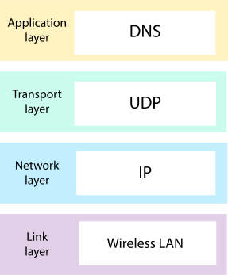
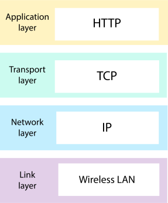
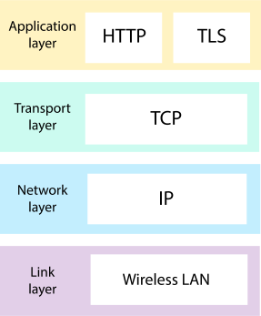

# Pesto Assignments

Welcome to Pesto assignment - 1.

### What is a protocol stack, and how is it used in web development?
There are many protocols that power the Internet. Each protocol operates at a different layer, building functionality on top of the layer below it and as there are multiple layers of protocols used which is called protocol stack.

When a message is sent through the Internet, it doesn't use every protocol in the suite. It does use at least one protocol from every layer, however.

When you're loading a webpage from a domain your browser has never visited before, your browser may need to make a DNS request. This stack of protocols is used when a DNS request is sent through the Internet:

Then your browser will make an HTTP request to fetch the webpage. This protocol stack is used when an HTTP request is sent through the Internet:

If the webpage is served over HTTPS, then the stack includes multiple protocols at the application layer (both HTTP and TLS):

-------------------------------------------------

### What are the different types of web servers, and how do they differ in terms of functionality and performance?

#### SERVER TYPES
This list categorizes the many different types of servers used in the marketplace today.

#### Proxy Server
A proxy server sits between a client program (typically a Web browser) and an external server (typically another server on the Web) to filter requests, improve performance, and share connections.

#### Mail Server
Almost as ubiquitous and crucial as Web servers, mail servers move and store mail over corporate networks (via LANs and WANs) and across the Internet.

#### Server Platforms
A term often used synonymously with operating system, a platform is the underlying hardware or software for a system and is thus the engine that drives the server.

#### Web Server
At its core, a Web server serves static content to a Web browser by loading a file from a disk and serving it across the network to a user’s Web browser. This entire exchange is mediated by the browser and server talking to each other using HTTP.

#### Application Server
Sometimes referred to as a type of middleware, application servers occupy a large chunk of computing territory between database servers and the end user, and they often connect the two.

#### Real-Time Communication Server
Real-time communication servers, formerly known as chat servers or IRC Servers, and still sometimes referred to as instant messaging (IM) servers, enable large numbers users to exchange information near instantaneously.

#### FTP Server
One of the oldest of the Internet services, File Transfer Protocol makes it possible to move one or more files securely between computers while providing file security and organization as well as transfer control.

#### Collaboration Server
In many ways, collaboration software, once called ‘groupware,’ demonstrates the original power of the Web. Collaboration software designed to enable users to collaborate, regardless of location, via the Internet or a corporate intranet and to work together in a virtual atmosphere.

#### List Server
List servers offer a way to better manage mailing lists, whether they be interactive discussions open to the public or one-way lists that deliver announcements, newsletters or advertising.

#### Telnet Server
A Telnet server enables users to log on to a host computer and perform tasks as if they’re working on the remote computer itself.

#### Open Source Server
From your underlying open source server operating system to the server software that help you get your job done, open source software is a critical part of many IT infrastructures.

#### Virtual Server
In 2009, the number of virtual servers deployed exceeded the number of physical servers. Today, server virtualization has become near ubiquitous in the data center.

#### Cloud Server
A simple cloud server definition is cloud servers are virtual (not physical) servers running in a cloud computing environment that can be accessed on demand by unlimited users.

Cloud servers work just like physical servers and they perform similar functions like storing data and running applications. Because cloud services are hosted by third-party providers, they deliver computing resources over a network, most often through the internet.

Cloud servers are created by using virtualization software (known as a hypervisor) to divide physical servers into multiple virtual servers. A hypervisor abstracts the server's processing power and pools them together, creating virtual servers.

-------------------------------------------------

### What is web hosting, and what are the different types of hosting services available for websites?

Web Hosting is a service that allows hosting/post-web-server applications( website or web page ) on a computer system through which web-browser clients can have easy access to electronic content on the Internet.

There are six types of web hosting you will most often come across: 

#### 1. Shared hosting
Shared hosting is perfect for entry-level website hosting. This is where your website will be stored on the same server as multiple other websites. With a shared hosting plan, all domains share the same server resources, such as RAM (Random Access Memory) and CPU (Central Processing Unit). However, because all resources are shared, the cost of shared hosting plans are relatively low, making them an excellent option for website owners in their beginning stages. 

In most cases, beginners will find shared the simplest method of hosting their website; so regardless of whether you’re a small business owner, a community group, or a stay-at-home mom with a desire to blog, your site will be accessible on the web. Shared hosting plans often comes with many helpful tools, and you can easier end up with bonus services such as the best website builder tools, the best WordPress hosting, and the ability to email clients.

Although shared hosting provides website owners with a more simplistic approach to the web, the trade-off is that you’re sharing the server with multiple other website owners. This means that surges in usage can ultimately affect your website’s user experience. 

Shared hosting plans are ideal for website owners that do not receive a large amount of web traffic.

#### 2. VPS hosting
A VPS hosting plan is the ultimate middle ground between a shared server and a dedicated server. It’s ideal for website owners that need more control, but don’t necessarily need a dedicated server.

VPS hosting is unique because each website is hosted within its own space on the server, though it still shares a physical server with other users. While VPS hosting provides website owners with more customization and storage space, they’re still not able to handle incredibly high traffic levels or spikes in usage meaning that the site performance can still be affected by other sites on the server

Typically, VPS hosting is used by website owners who want dedicated hosting but don’t have the technical knowledge needed. VPS hosting offers the cost benefits of shared hosting with the control of dedicated hosting. A great choice for advanced users and those that want specific software and package installations.

#### 3. Dedicated server hosting
Dedicated hosting gives website owners the most control over the server that their website is  stored on. That’s because the server is exclusively rented by you and your website is the only one stored on it. This means that you have full root and admin access, so you can control everything from security to operating system that you run.

However, all that control comes with a price.

Dedicated servers cost are one of the most expensive web hosting options. Typically, they are used by website owners with high levels of website traffic, and those who are in need of complete control of their servers. In addition, a high level of technical expertise is required for the installation and ongoing management of the server. 

#### 4. Cloud hosting
Cloud hosting is the current buzzword of the technology industry. In regards to web hosting, it means many computers working together, running applications using combined computing resources. It’s a hosting solution that works via a network and enables companies to consume the computing resource like a utility.

This allows users to employ as many resources as they need without having to build and maintain their own computing infrastructure. The resources that are being used are spread across several servers, reducing the chance of any downtime due to a server malfunction.

Cloud-based hosting is scalable, meaning your site can grow over time, using as many resources as it requires and while the website owner only pays for what they need.

#### 5. Managed hosting
Most hosting packages you will find online are likely to be managed. Hosting companies provide technical services such as hardware and software setup and configuration, maintenance, hardware replacement, technical support, patching, updating and monitoring. With managed hosting, the provider looks after the day-to-day management of the hardware, operating systems and standardised applications.

Although there are many different options to choose from when it comes to web hosting, it all comes down to choosing a plan that fits your needs. Each plan caters to the specifications of different groups and realizing what your needs in a website are will help you ensure that you’re choosing the right plan for you and your business. 

#### 6. Colocation
Instead of keeping servers in-house or at a private data centre, you may choose to ”‘co-locate” your equipment by renting space in a colocation centre. The centre will provide the power, bandwidth, IP address and cooling systems that your server requires. Space is rented out in racks and cabinets.

Colocation gives access to higher levels of bandwidth than a normal office server room at a much lower cost. You’re left to your own devices (literally) and will be expected to take care of everything including the hardware, software and services.

-------------------------------------------------

### What is scaling, and why is it important for web applications? How does scaling differ for vertical and horizontal scaling?

Application scaling involves optimizing the app’s architecture, infrastructure, and resources. It aims at handling the increased load without compromising performance, reliability, and user experience.

#### o  Vertical scaling: 
Also called scaling up/down. With vertical scaling, you increase or decrease the number of virtual central processing units (vCPUs), memory, or storage for an existing resource. An example of scaling up is changing a t3.micro EC2 instance, which has 2 vCPUs and 1 GB memory, to a t3.medium instance, which has 2 vCPUs and 4 GB memory.

#### o  Horizontal scaling: 
Also called scaling in/out. With horizontal scaling, you increase or decrease the number of resources in your infrastructure. An example of scaling out would be if you are hosting a web app on a single EC2 server and you add two more EC2 instances.

-------------------------------------------------

### What is SEO (Search Engine Optimization), and how can web developers optimize their websites for better search engine rankings?

SEO stands for search engine optimization. SEO practitioners optimize websites, web pages and content for the purposes of ranking higher in search engines, like Google. SEO is a set of practices designed to improve the appearance, positioning, and usefulness of multiple types of content in the organic search results

### Check your links
Googlebot navigates from URL to URL by fetching and parsing links, sitemaps, and redirects. Googlebot treats every URL as if it's the first and only URL it has seen from your site. To make sure that Googlebot can find all the URLs on your site:

Use ancor elements that Google can crawl. Ensure that all pages on the site can be reached by a link from another findable page. Make sure the referring link includes either text or, for images, an alt attribute, that is relevant to the target page.
Build and submit a sitemap to help Googlebot more intelligently crawl your site. A sitemap is a file where you provide information about the pages, videos, and other files on your site, and the relationships between them.
For JavaScript apps that have only one HTML page, make sure that each screen or piece of individual content has a URL.

### Check how you're using JavaScript

While Google does run JavaScript, there are some differences and limitations that you need to account for when designing your pages and applications to accommodate how crawlers access and render your content. Learn more about the basics of JavaScript SEO or how to fix Search-related JavaScript problems.

### Keep Google updated when content changes

To make sure that Google finds your new or updated pages quickly:
Submit sitemaps.
Ask Google to recrawl your URLs.

### Don't forget about the words on the page
Googlebot can only find content that is textually visible. For example, text in videos is invisible to Googlebot. To make sure that Google Search understands what your page is about:

Make sure that your visual content is expressed in text form. For example, a product category page that contains a list of images of shirts with no textual context about each image is suboptimal. The product category page should include some textual explanation for each image.

Make sure that every page has a descriptive title and meta description. Unique titles and meta descriptions help Google show how your pages are relevant to users, which in turn can increase your search traffic.

Use semantic HTML. While Google indexes HTML, PDF content, images, and videos, it doesn't index content that requires plugins (for example, Java or Silverlight) or content that is rendered in a canvas. Instead of using a plugin, use semantic HTML markup for your content whenever possible.